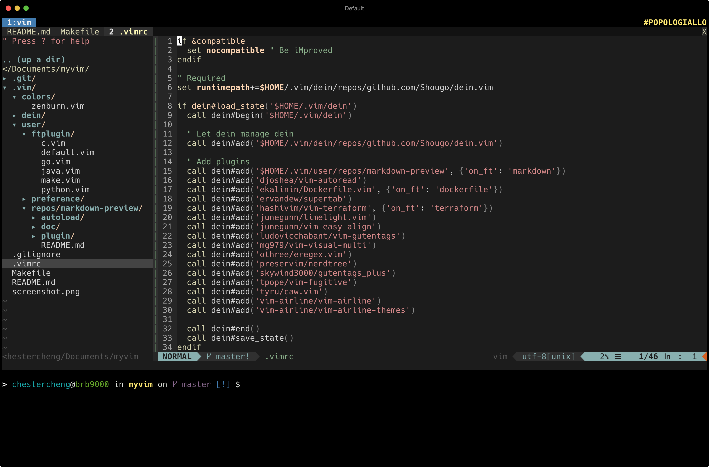

# My Vim Config



## Installation

Includes:

* Vim v8.2.0012

* Exuberant Ctags 5.8

* GNU GLOBAL 6.3.3

```bash
git clone https://github.com/chestercheng/myvim.git
cd myvim && make all
```

## File Structure

```
.
├── .vim
│   ├── colors
│   │   └── zenburn.vim
│   ├── dein
│   │   ├── .cache
│   │   └── repos
│   │       └── github.com
│   │           ├── Shougo
│   │           │   └── dein.vim
│   │           └── ...
│   └── user
│       ├── ftplugin
│       │   ├── default.vim
│       │   ├── python.vim
│       │   └── ...
│       ├── preference
│       │   ├── general.vim
│       │   └── ...
│       └── repos
│           ├── markdown-preview
│           └── vim-moonfly-statusline
├── .vimrc
├── Makefile
└── README.md
```
## Plugins Management

[dein.vim](https://github.com/Shougo/dein.vim) - Dark powered Vim/Neovim plugin manager

Usage:

> Run command at Vim (command mode).

* Update plugins

    ```
    :call dein#update()
    ```

* Remove the disabled plugins

    ```
    call map(dein#check_clean(), "delete(v:val, 'rf')")
    call dein#recache_runtimepath()
    ```

## Plugins

* [djoshea/vim-autoread](https://github.com/djoshea/vim-autoread) - Have Vim automatically reload a file that has changed externally

* [ekalinin/Dockerfile.vim](https://github.com/ekalinin/Dockerfile.vim) - Vim syntax file & snippets for Docker's Dockerfile

* [ervandew/supertab](https://github.com/ervandew/supertab) - Perform all your vim insert mode completions with Tab

* [junegunn/limelight.vim](https://github.com/junegunn/limelight.vim) - All the world's indeed a stage and we are merely players

* [junegunn/vim-easy-align](https://github.com/junegunn/vim-easy-align) - A Vim alignment plugin

* [ludovicchabant/vim-gutentags](https://github.com/ludovicchabant/vim-gutentags) - A Vim plugin that manages your tag files https://bolt80.com/gutentags/

* [mg979/vim-visual-multi](https://github.com/mg979/vim-visual-multi) - Multiple cursors plugin for vim/neovim

* [othree/eregex.vim](https://github.com/othree/eregex.vim) - Perl/Ruby style regexp notation for Vim

* [preservim/nerdtree](https://github.com/preservim/nerdtree) - A tree explorer plugin for vim

* [skywind3000/gutentags_plus](https://github.com/skywind3000/gutentags_plus) - The right way to use gtags with gutentags

* [tpope/vim-fugitive](https://github.com/tpope/vim-fugitive) - fugitive.vim: A Git wrapper so awesome, it should be illegal

* [tyru/caw.vim](https://github.com/tyru/caw.vim) - Vim comment plugin: supported operator/non-operator mappings, repeatable by dot-command, 300+ filetypes
